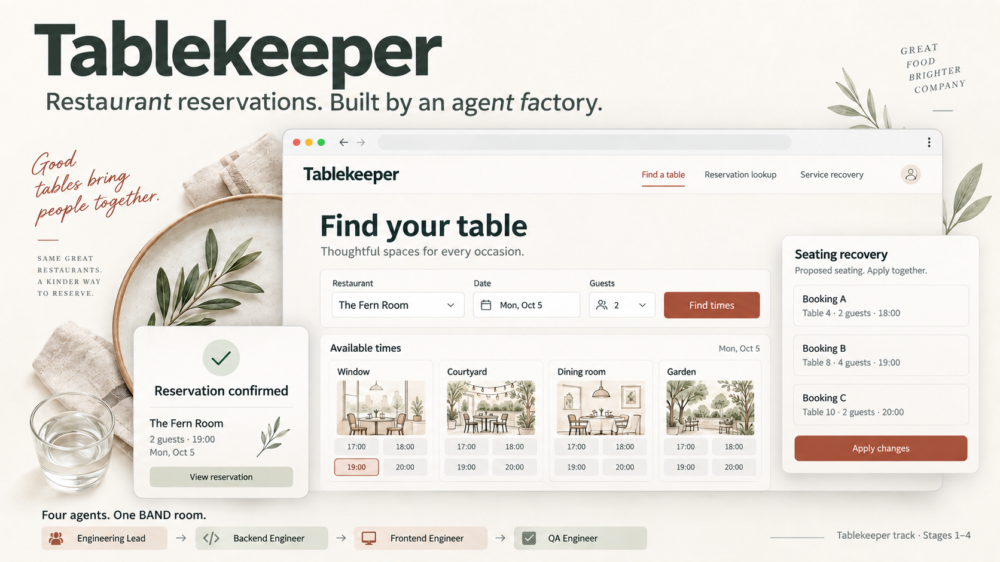

# Tablekeeper

A restaurant reservation service built by four coding-agent seats collaborating in BAND Desktop.

All four stage snapshots are included. The factory's independent QA accepted each snapshot before it was extended into the next stage. The shipped checks are partial, directional evidence; their results do not guarantee the organizers' hidden-test outcome.



## Start the final product

Prerequisite: Docker with internet access for image builds. No Node or Python installation is required to run the application. The running service requires no outbound internet access.

From the repository root:

```sh
docker build -t tablekeeper ./stage-4
docker run --rm --name tablekeeper -p 127.0.0.1:8104:8104 -e PORT=8104 tablekeeper
```

Open **http://localhost:8104/** or **http://127.0.0.1:8104/**. Health is available at `/health`. Stop with Ctrl+C or `docker stop tablekeeper`. Each snapshot also has its own [RUN.md](stage-4/RUN.md); run snapshots separately because Stages 1 and 2 share a documented host port.

Uvicorn logs `0.0.0.0` because it listens on all interfaces inside the container. Docker forwards the port to your computer's loopback address. Use `localhost` or `127.0.0.1` in your browser. To display `localhost` in the terminal too, use this **PowerShell** command instead of the `docker run` command above:

```powershell
docker run --rm --name tablekeeper -p 127.0.0.1:8104:8104 -e PORT=8104 tablekeeper 2>&1 |
    ForEach-Object { $_.ToString().Replace('http://0.0.0.0:8104', 'http://localhost:8104') }
```

This changes the displayed log only; the container keeps the binding required for Docker port forwarding. Stop this launch with `docker stop tablekeeper` from another terminal.

The service starts with empty state. For a usable, clearly labelled restaurant open on all seven weekdays, follow [the opt-in Stage 4 demo instructions](stage-4/demo/README.md) in a separate disposable container. Sign up normally, search availability, select a table/time, reserve, then retrieve or cancel using the confirmation reference. Booking days follow actual restaurant hours; no weekday is hard-coded.

Manager permissions come from the service's configured membership. The public signup form does not create managers, and the simple multi-day demo seeds no manager account. Policy publication and service recovery require a fixture with an authorized manager. Independent checks exercise those flows using isolated test fixtures; no public role picker or invented dashboard metrics bypass authorization.

State is ephemeral across container restarts. The API supports atomic export/import across these snapshots, preserving sessions, identifiers, original retry receipts and histories. Test reset/import controls are intended for disposable evaluation environments.

## What each snapshot contains

| Folder | Implemented scope |
| --- | --- |
| [stage-1](stage-1/RUN.md) | Authentication, availability, reservations, amendments/cancellation, atomic collective moves, concurrency-safe retries, timezone handling and state export/import. |
| [stage-2](stage-2/RUN.md) | Browser booking/lookup, declared table combinations, stale-state feedback and recovery after lost committed responses. |
| [stage-3](stage-3/RUN.md) | Effective-dated policies, retained accepted terms/history and recurring reservations with independent exceptions. |
| [stage-4](stage-4/RUN.md) | Exact bounded seating-recovery previews, atomic closure application and amendments of eligible recurring visits. |

Stages 2–4 serve React/TypeScript assets and the Python API from one origin. The backend uses FastAPI/Uvicorn, SQLite transactions and timezone data; the frontend bundles its fonts, illustrations and licenses. One worker serializes atomic state changes. Every stage is independently buildable.

## Factory and verification evidence

Read [FACTORY.md](FACTORY.md) for seat setup, ownership, handoffs, independent review, costs and limitations. The authentic [room.json](room.json) export comes from [the completed BAND room](https://app.band.ai/sessions/018b7708-b06b-404a-8c00-2cc53c64a9d3); the original implementation history is preserved in Git. [run.json](run.json) records the roster and models, and [requirements.md](requirements.md) preserves the supplied task and full specifications.

The final clean-clone isolated acceptance recorded:

| Snapshot | Shipped suites passed |
| --- | --- |
| Stage 1 | 120/120 |
| Stage 2 | 120/120 + 25/25 |
| Stage 3 | 120/120 + 25/25 + 7/7 |
| Stage 4 | 120/120 + 25/25 + 7/7 + 6/6 |

No claimed suite failed, errored or skipped. Stage 4's six shipped checks are smoke coverage. Independent checks additionally cover optimizer objectives, concurrency, rollback, populated imports, DST, authorization, retry recovery and actual native browser zoom. See [COVERAGE.md](COVERAGE.md), [DELIVERY.md](DELIVERY.md), [SUBMISSION-FACTS.md](SUBMISSION-FACTS.md) and [the final QA report](evidence/final-efcfd4b-01/qa-final-recheck.md). Genuine failure evidence is retained; future-stage probes against earlier snapshots are distinguished from claimed-stage failures.

Submission packaging was also checked from a fresh `git clone --no-local` at `ec7d6c1a4f34cf7ac2518d5086f1011bd7481aaf`. The offline submission gates passed, isolated `--all` reproduced all four claimed chains above, and every stage built and launched following its own runbook. Stages 2–4 additionally served their routes, bundled assets and opt-in demo fixtures. See [packaging validation](evidence/packaging-ec7d6c1/VALIDATION.md).

To reproduce organizer checks, obtain the official [challenge repository](https://github.com/band-ai/dark-factory-wearedevs), pinned for this run to `803560d2a678ace1414465c098eb0ab5380ffade`, and install its harness according to its participant guide. Run from that challenge checkout, with Python 3.12 and Docker available:

```sh
python -m harness check /absolute/path/to/tablekeeper --track tablekeeper
python -m harness run --track tablekeeper --repo /absolute/path/to/tablekeeper --all --mode isolated --out /absolute/path/to/new-evidence-directory
```

Use a new output directory each time. Isolated evaluation supplies 2 CPU and 2 GiB with outbound network blocked. Image builds may fetch their pinned dependencies. Historical evidence contains the original workspace path; the repository was subsequently moved without changing accepted application source.

## Assets and submission scope

Approved illustrations were generated with OpenAI imagegen. Source Sans 3 is supplied under SIL OFL, and Tabler icons under MIT; retain the notices and license files bundled with each frontend's assets. See [asset provenance](stage-4/web/public/assets/NOTICE.md).

The project's original code and documentation are supplied under the [MIT License](LICENSE). Bundled third-party assets retain their accompanying licenses and notices.

The room export, mandate metadata and these documentation files were packaged after implementation. Documentation was drafted with Codex assistance from recorded evidence; the participant must review and take responsibility for the final narrative. Public GitHub publication, presentation/video and event submission are separate participant actions. The video must show the actual BAND room, a handoff and the resulting product.
